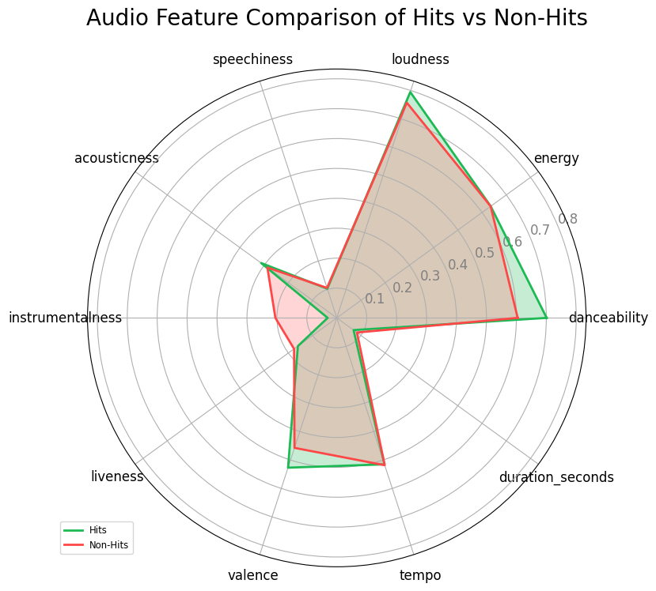
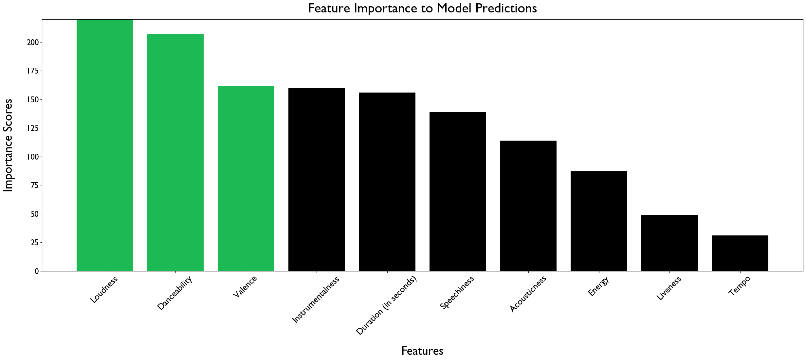
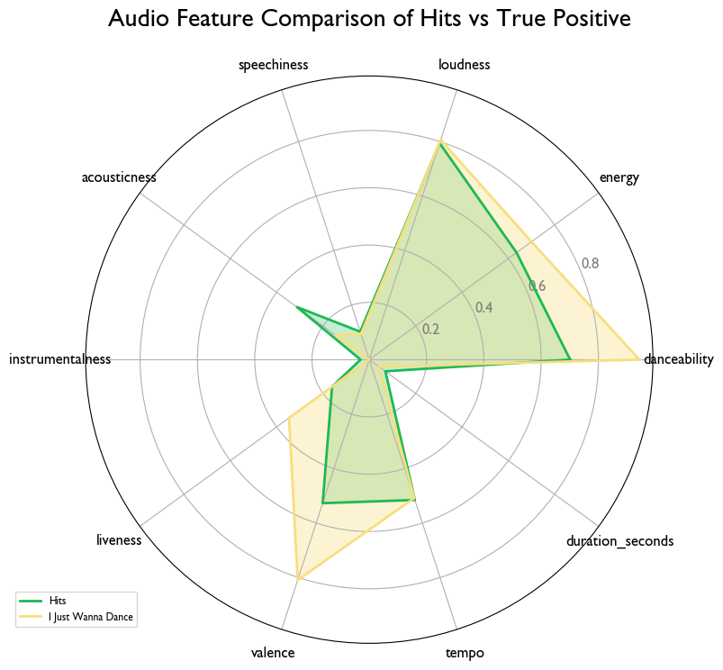
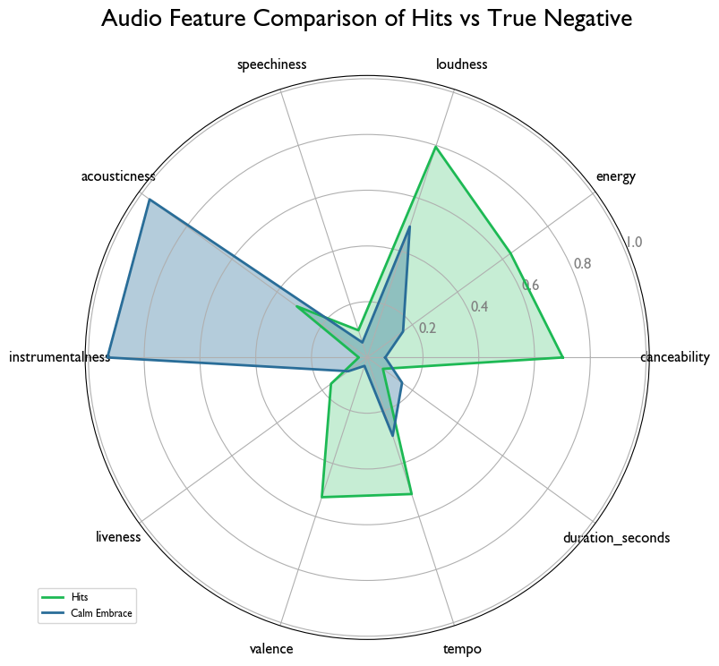

# Is It A Hit?

**Author**: Dermot O'Brien

## Overview
Spotify is not profitable. Its largest expenses are the licensing fees paid to major record labels that allow Spotify to stream their clients music. Is there a way Spotify can reduce these licensing fees? 60,000 songs are uploaded to Spotify's platform [daily](https://toneisland.com/spotify-statistics/#:~:text=Spotify%20uploads%2060%2C000%20new%20tracks%20every%20day.,-Spotify%20confirms%20through&text=That%20amounts%20to%2022%20million,million%20tracks%20in%20its%20database.), giving Spotify early access to data unseen by other interested parties. If Spotify were able to recognize talent on their own using this competitively advantageous data, they could potentially discover unrecognized artists with high potential before the record labels, create their own record label and sign these hidden gems, and reduce/avoid the high licensing costs paid to labels. If changing their business model is too large of a task, they can at the very least understand which songs and artists to bolster with funding and team support to maximize streams and optimize resource allocation.

## Business Problem
To ensure the success of Spoify’s own label, they need to be able to instantaneously - on first upload to the database - decide whether or not a song will be a success. As a consultant of Spotify, I will work to create a model that can be used by Spotify that recognizes those high-potential hit songs based on Spotify's own data - specifically audio features and spotify-specific features. 

## I. Data Importing and Dataframe Creation
To create the data frame used for modeling, three steps will be required. First, I will need to pull a list of ids from Kaggle's [Every Noise at Once Dataset](https://www.kaggle.com/datasets/nikitricky/every-noise-at-once/discussion?select=songs.csv) that can pass through a tool called spotipy - a python library connected to Spotify's Web API. Note that I will only be using data between January 2020 and September 2021 for relevance purposes. Next, I will pass the list of ids through spotipy's .audio_features method and create a features dataframe. Finally, I'll pass the list of ids through spotipy's .tracks method to create a popularity dataframe. After concatenating these two dataframes, we will have a comprehensive dataframe to begin our analysis. For a cleaner notebook, I've created the features and popularity dataframes in an alternate notebook. If you are interested in learning how to get spotify api authorization and how to pull data through spotipy, refer to my walkthrough/guide notebook [here](./Walkthroughs/Dataframe_Creation_With_Spotipy.ipynb).

## II. Data Understanding
### Column Names and Understanding
* `danceability`: [str] Describes how suitable a track is for dancing. A value of 0.0 is least danceable and 1.0 is most danceable.
* `energy`: [float] Represents a perceptual measure of intensity and activity. A measure from 0.0 to 1.0.
* `key`: [int] The key the track is in. Integers map to pitches using standard Pitch Class notation. E.g. 0 = C, 1 = C♯/D♭, 2 = D, and so on. If no key was detected, the value is -1.
* `loudness`: [float] The overall loudness of a track in decibels (dB). Values typically range between -60 and 0 db.
* `mode`: [int] Modality of a track. Major is represented by 1 and minor is 0.
* `speechiness`: [float] Detects the presence of spoken words in a track. The more exclusively speech-like the recording (e.g. talk show, audio book, poetry), the closer to 1.0 the attribute value. Values above 0.66 describe tracks that are probably made entirely of spoken words. Values between 0.33 and 0.66 describe tracks that may contain both music and speech, either in sections or layered, including such cases as rap music. Values below 0.33 most likely represent music and other non-speech-like tracks.
* `accousticness`: [float] A confidence measure from 0.0 to 1.0 of whether the track is acoustic. 1.0 represents high confidence the track is acoustic.
* `instrumentalness`: [float] Predicts whether a track contains no vocals. Values above 0.5 are intended to represent instrumental tracks, but confidence is higher as the value approaches 1.0.
* `liveness`: [float] Detects the presence of an audience in the recording. Higher liveness values represent an increased probability that the track was performed live. A value above 0.8 provides strong likelihood that the track is live.
* `valence`: [float] A measure from 0.0 to 1.0 describing the musical positiveness conveyed by a track. Tracks with high valence sound more positive.
* `tempo`: [float] The overall estimated tempo of a track in beats per minute (BPM).
* `type`: [str] The object type (audio_features)
* `id`: [str] The Spotify ID for the track.
* `uri`: [str] The Spotify URI for the track.
* `track_href`: [str] A link to the Web API endpoint providing full details of the track.
* `analysis_url`: [str] A URL to access the full audio analysis of this track. An access token is required to access this data.
* `duration_ms`: [int] The duration of the track in milliseconds.
* `time_signature`: [int] An estimated time signature. The time signature (meter) is a notational convention to specify how many beats are in each bar (or measure). The time signature ranges from 3 to 7 indicating time signatures of "3/4", to "7/4".
* `popularity`: [int] The target variable. The popularity of a track is a value between 0 and 100, with 100 being the most popular. The popularity is calculated by an algorithm and is based on the total number of plays the track has had and how recent those plays are. Generally speaking, songs that are being played a lot now will have a higher popularity than songs that were played a lot in the past. Duplicate tracks (e.g. the same track from a single and an album) are rated independently. Artist and album popularity is derived mathematically from track popularity.

## III. Data Preparation
I'll need to add a binary column that indicates whether a song is a "hit" or not. This will be classified by songs with a popularity score > 50. Since we're looking at older songs (Jan 2020 - Sep 2021), I lowered the threshold of popularity since the algorithm from spotify adds more weight to recent streams.

* `hit`: new column - indicates if that song is a hit or not

Let's also drop inutile columns:
* `key`: looks somewhat equally distributed
* `time_signature`: mostly all songs have a time signature of 4
* `popularity`: since we changed this to a binary (Hit or no hit), we can drop this column
* Non-numeric columns to drop: `type`, `id`, `uri`, `track_href`, `analysis_url`

### Data Analysis Visualization


## IV. Data Modeling
Now that our data is clean, it's time for modeling. Since I will want to know which features are most impacting the models predictions, I am going to use tree-based models. This will allow me to pull feature importances later on.

### Modeling Evaluation Metric - Precision
As we iterate our models, it's important to distinguish which evaluation metric we want to focus on maximizing.  Music labels want to maximize the ability to predict a hit song correctly. It is more important that they predict a hit correctly, opposed to missing out on a song that eventually becomes a hit. In this instance, precision is most important to Spotify's bottom line. Remember that precision in our context evaluates how well our model correctly predicts whether a song will be a hit or not:

Precision = True positives / (True positives + False positives)
* Basically, of all of our predicted hit songs, how many were actually hit songs?

Recall = True positives / (True positives + False negatives)
* Recall measures how many actual hits we predicted correctly.

If we classified a song as a non-hit, but then it becomes a hit (false negative), we're not losing much monetarily given we never actually invested time/resources into that song/artist. On the other hand, if we predict a song is a hit and it ends up being a flop (false positive) we have now lost a lot of time and money on a dud. The later scenario is one that we want to minimize, which is why we are focusing on precision.

## V. Results


Our XGBoost model gave us a precision score of 90% on unseen data. Compared to our cross validation score of 92% on the same model, we can conclude that the model is slightly overfit but not in a concerning way. Also, since were trying to maximize precision, our model is predicting very little False Positives and instead is playing it safe and predicting more False Negatives. This is ok for now, but we may want to address this in the future. The top 3 contributors to the model's predictions, as seen on the bar chart above, are Loudness, Danceability, and Valence. This is supported by the radar chart shown in the Data Analsysis Vizualization section.

### True Positive Example

Song: 'I Just Wanna Dance' by Tiagz, found [here.](https://open.spotify.com/album/2Vhae443nTW2v9QVSmYSXq)

### True Negative Example

Song: 'Calm Embrace' by Esa Plant, found [here.](https://open.spotify.com/album/0ECjtVkMi9MHOwrDdsi3eo)

### False Positive Example

Song: 'Cloud 9' by Beach Bunny, found [here.](https://open.spotify.com/album/2SYelZBfY0RncM033QPWiw)

## VI. Evaluation
With a final precision score of 90% on unseen data, we can say that our model is doing a very good job at minimizing the amount of incorrect songs it classifies as a hit. To reiterate, this is very important since Spotify wants to be sure that a song they classify as a hit - and therefore put time and money into supporting - actually has potential to be a hit and not a flop.

### Limitations
With any project comes it's limitations:
* **Not enough data**: After data preparation, I had just over 66,000 rows (songs) in my final dataset. If you recall, 60,000 songs are uploaded daily to Spotify's platform, and there are over 90 million songs on the platform [currently.](https://newsroom.spotify.com/company-info/#:~:text=Discover%2C%20manage%20and%20share%20over,ad%2Dfree%20music%20listening%20experience.) The use of more data can reduce overfitting and better represent Spotify's database. 
* **Features not accounted for have a large impact on song popularity**: Although this analysis only focused on audio features, we can't deny that other factors such as artist popularity, date released, and whether or not they have partnerships with Spotify have massive impacts on song popularity. We can't do anything about this, but it is important to note.
* **High precision but low recall**: We know that recall and precision inversely affect each other; however, in the future we may want to try to maintain a high precision score without sacrificing too much from precision, thereby increasing accuracy and f1 scores in tandem.

## VII. Conclusions
My hope is  that Spotify can use this data to better their company, whether that be through the creation of a record label, or a better understanding of which artists they should support. It is hard to ignore the fact that music is incredibly subjective, and many would argue against the use of data to classify an art that cannot be reduced to numbers and figures but only understood through emotion and feeling. This analysis is not intended to minimize the trained ear that can only be obtained from decades in the studio; rather, it highlights an alternative approach to recognize patterns in those  aspects of music that are quantifiable and possibly overlooked.

## For More Information

Please review our full analysis in [our Jupyter Notebook](./Final_Notebook.ipynb) or our [presentation](./Spotify_Presentation.pdf).

For any additional questions, please contact **Dermot O'Brien @dermot.obri@gmail.com**

## Repository Structure

Describe the structure of your repository and its contents, for example:

```
├── README.md                     <- The top-level README for reviewers of this project
├── Final_Notebook.ipynb          <- Narrative documentation of analysis in Jupyter notebook
├── Spotify_Presentation.pdf      <- PDF version of project presentation
├── Data                          <- Folder containing Data used
├── Images                        <- Folder containing Images used
├── Scratch_Workbooks             <- Folder containing Scratch Workbooks
├── Visuals                       <- Folder containing visuals used for presentation
└── Walkthroughs                  <- Folder containing step-by-step instructions on pulling data from Spotify's API
```
